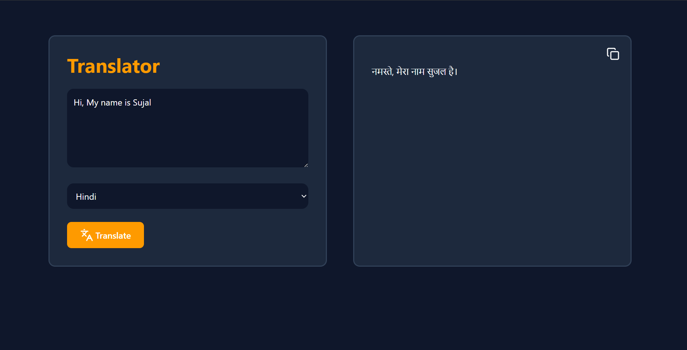

# React Language Translator

This is a simple and modern language translator application built with React and Vite. It leverages the Google Gemini API to provide fast and accurate translations. Users can input text, select a target language, and get the translated result instantly.


---

## ✨ Features

* **Translate text** into multiple languages.
* **Supported Languages**: Hindi, Marathi, English, Spanish, French, Japanese, and Chinese.
* **Copy to Clipboard**: Easily copy the translated text with a single click.
* **Loading Indicator**: Shows an animated loading state while fetching the translation.
* **User-Friendly Interface**: A clean, responsive, and intuitive UI built with Tailwind CSS.
* **Toast Notifications**: Provides feedback for actions like copying text or for errors.

---

## 🚀 Technologies Used

* **React**: A JavaScript library for building user interfaces.
* **Vite**: A fast build tool for modern web projects.
* **Google Gemini API**: The powerful language model used for translations.
* **Tailwind CSS**: A utility-first CSS framework for rapid UI development.
* **Axios**: A promise-based HTTP client for making API requests.
* **Lucide React**: A library of beautiful and consistent icons.
* **React Toastify**: A library for adding toast notifications to your app.

---

## 🏁 Getting Started

### Prerequisites

* Node.js (v18 or higher) and npm installed on your machine.
* A Google Gemini API Key. You can get one from **[Google AI Studio](https://ai.google.dev/)**.

### Installation & Setup

1.  **Clone the repository:**
    ```bash
    git clone https://github.com/Sujal-Dudhe/React-Language-Translator.git
    ```
2.  **Navigate to the project directory:**
    ```bash
    cd React-Language-Translator
    ```
3.  **Install dependencies:**
    ```bash
    npm install
    ```
4.  **Create an environment file:**
    * Create a `.env` file in the root of the project.
    * Add your Gemini API Key to it like this:
        ```env
        VITE_API_KEY=YOUR_GEMINI_API_KEY
        ```

---

## Run this app locally

```bash
npm run dev
```

## 📂 Project Structure
```bash
react-language-translator/
├── public/
│   ├── preview.png       # Project preview image
│   └── vite.svg
├── src/
│   ├── assets/
│   │   └── react.svg
│   ├── App.jsx           # Main application component and logic
│   ├── index.css         # Main CSS file with Tailwind imports
│   └── main.jsx          # Entry point of the React application
├── .env                  # Environment variables (Untracked by Git)
├── .gitignore
├── eslint.config.js
├── index.html
├── package.json
├── README.md
└── vite.config.js
```
